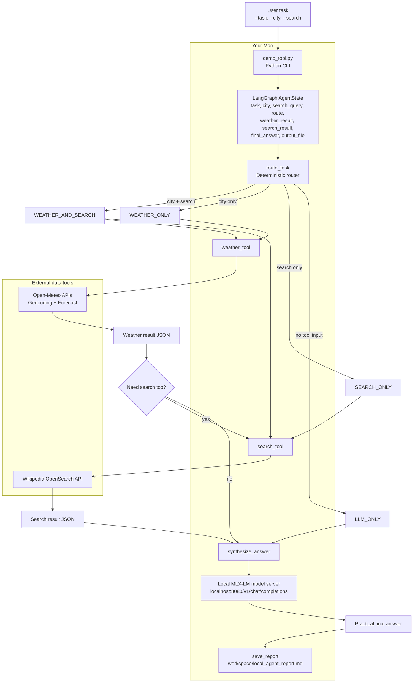

# I Built a Local AI Agent on My Mac — No API Key Needed

Run a local AI agent on Apple Silicon using MLX-LM, LangGraph, and real tools.

This repo is the companion project for a video walkthrough that shows how to build an agentic workflow without sending prompts to OpenAI, Claude, Gemini, or any hosted LLM API. The language model runs locally on your Mac, the workflow is controlled by LangGraph, and the tools fetch live external data.

The main file is `demo_tool.py`.

## What You Will Build

This demo shows the core building blocks of an AI agent:

- a local LLM served by MLX-LM on your Mac
- LangGraph state and routing
- a weather tool powered by Open-Meteo
- a search tool powered by Wikipedia OpenSearch
- local model synthesis through an OpenAI-compatible localhost endpoint
- a saved trace report at `workspace/local_agent_report.md`

The important idea is that the local model is not doing everything. It does not magically know the weather, and it does not directly browse the internet. LangGraph controls the workflow, tools fetch data, and the local LLM synthesizes the final answer.

## Why This Matters

Most AI agent demos use a cloud LLM API. That is useful, especially for production systems, but local models are excellent for learning agent architecture because the responsibilities become easier to see:

- the model handles language synthesis
- the tools provide external data
- the graph controls execution
- the state carries information between steps
- the report shows what happened

This project is not trying to beat frontier models. It is designed to make the architecture clear:

```text
Model + Tools + State + Routing + Synthesis + Trace
```

## MLX and MLX-LM

MLX is Apple's machine learning framework designed for Apple Silicon chips such as M1, M2, M3, M4, and newer Apple chips. It is built around the way Apple hardware works, including unified memory, where the CPU and GPU can work with the same shared memory system.

MLX-LM sits on top of MLX and makes it easier to run large language models locally. With MLX-LM, you can load models from Hugging Face, run quantized models, generate text, chat with models, and serve a local OpenAI-compatible endpoint.

In this demo, your Python code calls:

```text
http://localhost:8080/v1/chat/completions
```

That endpoint is running on your Mac. No LLM API key is required.

## Architecture

```text
User task
  -> demo_tool.py
  -> LangGraph state
  -> deterministic router
  -> weather tool and/or search tool
  -> local MLX-LM chat endpoint
  -> final answer
  -> local Markdown report
```



## What `demo_tool.py` Does

The code intentionally keeps the agent simple. It has five major parts:

1. State: stores the task, city, search query, selected route, tool results, final answer, and output file.
2. Local model call: sends prompts to the local MLX-LM server.
3. Router: decides which path the workflow should take.
4. Tools: calls weather and search APIs when needed.
5. Synthesis: asks the local model to turn the tool data into a practical answer.

Routes are selected deterministically:

- `WEATHER_AND_SEARCH`: runs both tools
- `WEATHER_ONLY`: runs only the weather tool
- `SEARCH_ONLY`: runs only the search tool
- `LLM_ONLY`: uses only the local model

For a beginner-friendly demo, deterministic routing is useful because the focus is architecture, not prompt magic. A good agent does not call every tool every time. It calls the tools required for the task.

## Requirements

Use this on an Apple Silicon Mac for the intended MLX workflow.

You need:

- Python 3.10 or newer
- MLX-LM
- LangGraph
- Requests
- Rich
- an internet connection for Open-Meteo and Wikipedia
- enough disk space and memory for a local Hugging Face model

Local model performance depends on your Mac, RAM, model size, quantization, and context length. A 4-bit quantized model is usually more practical on a laptop than a full-precision model.

## Setup

Create and activate a virtual environment:

```bash
python -m venv .venv
source .venv/bin/activate
```

Install the required packages:

```bash
pip install mlx-lm langgraph requests rich
```

If you already have an environment in this repo, you can run:

```bash
my_env/bin/python demo_tool.py --help
```

## Start the Local MLX-LM Server

In one terminal, start a local OpenAI-compatible MLX-LM server:

```bash
mlx_lm.server --model "Qwen3-4B-instruct-2507-4bit" --port 8080
```

Keep this terminal running.

If you prefer a different MLX-compatible model from Hugging Face, replace the model name with one that works well on your Mac. For smaller machines, a compact 4-bit model is recommended.

The demo expects the chat endpoint at:

```text
http://localhost:8080/v1/chat/completions
```

You can override it with:

```bash
export MLX_CHAT_URL="http://localhost:8080/v1/chat/completions"
```

If your MLX-LM server requires a model name in the request payload, set:

```bash
export LOCAL_MODEL_NAME="Qwen3-4B-instruct-2507-4bit"
```

## Run the Main Demo

Open a second terminal from the project folder.

Run weather plus search:

```bash
python demo_tool.py \
  --task "I am planning a day trip to Mysuru. Check the weather, search about Mysore Palace, and give me a practical recommendation." \
  --city "Mysuru" \
  --search "Mysore Palace"
```

Because both `--city` and `--search` are provided, the selected route should be:

```text
WEATHER_AND_SEARCH
```

The workflow will:

1. resolve Mysuru to latitude and longitude
2. fetch current weather and the next 12 hours of forecast data
3. search Wikipedia for Mysore Palace
4. pass both tool results to the local MLX-LM model
5. save the final report locally

## Other Demo Routes

Run weather only:

```bash
python demo_tool.py \
  --task "Should I carry an umbrella today?" \
  --city "Bengaluru"
```

Expected route:

```text
WEATHER_ONLY
```

Run search only:

```bash
python demo_tool.py \
  --task "Search about Apple MLX and explain why it matters for local AI." \
  --search "Apple MLX"
```

Expected route:

```text
SEARCH_ONLY
```

Run local model only:

```bash
python demo_tool.py \
  --task "Explain what a tool-routing agent is in simple terms."
```

Expected route:

```text
LLM_ONLY
```

## Output

The script prints each step in the terminal using Rich panels:

- user task
- selected route
- weather API result, if used
- search API result, if used
- final local model answer
- saved report path

It also writes a local Markdown report:

```text
workspace/local_agent_report.md
```

The report includes:

- the original user task
- the selected route
- weather tool output, if used
- search tool output, if used
- final answer from the local MLX-LM model

Agents should leave traces. When a workflow uses tools, you should be able to see which tools were used and what data the final answer was based on.

## CLI Reference

```bash
python demo_tool.py --task "..." [--city "..."] [--search "..."]
```

Arguments:

- `--task` is required. This is the user request the agent should answer.
- `--city` is optional. When provided, the weather tool runs.
- `--search` is optional. When provided, the Wikipedia search tool runs.

## Troubleshooting

If you see a connection error, make sure the MLX-LM server is running on port `8080`.

If synthesis fails but tools worked, the script still prints the weather and search results. This usually means the local model server was not reachable or returned an unexpected response.

If model startup is slow, use a smaller or more heavily quantized model.

If the weather tool fails, check your internet connection. The weather flow depends on Open-Meteo APIs.

If the search tool fails, check your internet connection. The search flow depends on the Wikipedia API.

If imports fail, reinstall the dependencies:

```bash
pip install mlx-lm langgraph requests rich
```

## Honest Limitations

Local LLMs are powerful for learning, experimentation, privacy-sensitive workflows, and offline-friendly development, but they have limits.

A small 4-bit model may not reason like a frontier cloud model. It may need more structured prompts, and it may struggle with complex planning. For production systems, you may still choose OpenAI, Claude, Gemini, Bedrock, Ollama, vLLM, or another runtime.

The valuable skill is understanding the architecture. Once the pattern is clear, the model backend becomes replaceable.

## Learn More

Join the free community and get the PDF guide for this local MLX agent setup:

https://community.nachiketh.in

Want a structured path for building real AI applications with Claude Code and AI workflows?

Join Claude Code & AI Builder Lab:

https://learn.manifoldailearning.com/services/claude-code-ai-builder-lab
