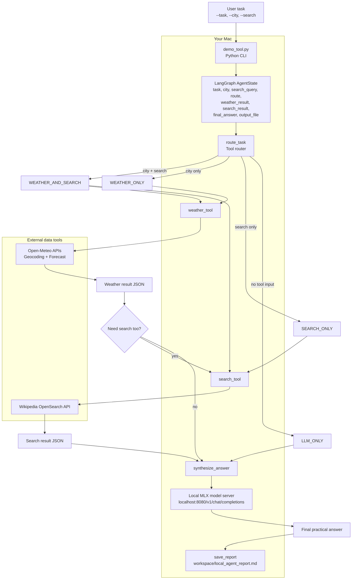

# Local MLX Tool Routing Agent Demo

Run a local AI agent on your Mac with MLX, LangGraph, and simple external tools.

This project demonstrates a practical agent loop:

- routes a user task based on the inputs you provide
- calls a weather tool through Open-Meteo when you pass a city
- calls a search tool through Wikipedia when you pass a search query
- sends the tool results to a local MLX model for final synthesis
- saves a Markdown report in `workspace/local_agent_report.md`

The main file for this demo is `demo_tool.py`.

## Architecture



In plain English: the user gives a task, LangGraph routes it to the right tools, the tools fetch live data, and the local MLX model synthesizes the final answer. The report is saved locally on your Mac.

## What `demo_tool.py` does

`demo_tool.py` builds a LangGraph workflow with five steps:

1. `route_task` decides whether the task needs weather, search, both, or only the local model.
2. `weather_tool` calls Open-Meteo geocoding and forecast APIs.
3. `search_tool` calls the Wikipedia OpenSearch API.
4. `synthesize_answer` sends the tool outputs to a local MLX chat-completions server.
5. `save_report` writes the final trace and answer to `workspace/local_agent_report.md`.

Routes are selected from these values:

- `WEATHER_AND_SEARCH`
- `WEATHER_ONLY`
- `SEARCH_ONLY`
- `LLM_ONLY`

## Requirements

Use this on an Apple Silicon Mac for the MLX local model workflow.

You need:

- Python 3.10 or newer
- MLX LM
- LangGraph
- Requests
- Rich
- an internet connection for the weather and Wikipedia tools
- enough disk space to download a local model from Hugging Face

## Setup

Create and activate a virtual environment:

```bash
python -m venv .venv
source .venv/bin/activate
```

Install the required packages:

```bash
pip install mlx-lm langgraph requests rich
```

If you already want to use the included environment, you can run commands with:

```bash
my_env/bin/python demo_tool.py --help
```

## Start the Local MLX Model Server

In one terminal, start an OpenAI-compatible MLX server:

```bash
mlx_lm.server --model mlx-community/Qwen2.5-1.5B-Instruct-4bit --host 127.0.0.1 --port 8080
```

Keep this terminal running.

The demo expects the chat endpoint at:

```text
http://localhost:8080/v1/chat/completions
```

You can override it with:

```bash
export MLX_CHAT_URL="http://localhost:8080/v1/chat/completions"
```

If your MLX server requires a model name in the request payload, set:

```bash
export LOCAL_MODEL_NAME="mlx-community/Qwen2.5-1.5B-Instruct-4bit"
```

## Run the Demo

Open a second terminal from the project folder.

Run weather plus search:

```bash
python demo_tool.py \
  --task "Should I plan an outdoor AI meetup in Bengaluru tomorrow? Include weather and local context." \
  --city "Bengaluru" \
  --search "Bengaluru AI meetup"
```

Run weather only:

```bash
python demo_tool.py \
  --task "Should I carry an umbrella today?" \
  --city "Mumbai"
```

Run search only:

```bash
python demo_tool.py \
  --task "Give me useful context about LangGraph for local agents." \
  --search "LangGraph AI agent"
```

Run local model only:

```bash
python demo_tool.py \
  --task "Explain what a tool-routing agent is in simple terms."
```

## Output

The script prints each step in the terminal with Rich panels.

It also saves a report here:

```text
workspace/local_agent_report.md
```

The report includes:

- the original user task
- the selected route
- weather tool output, if used
- search tool output, if used
- final answer from the local MLX model

## CLI Reference

```bash
python demo_tool.py --task "..." [--city "..."] [--search "..."]
```

Arguments:

- `--task` is required. This is the user request the agent should answer.
- `--city` is optional. When provided, the weather tool runs.
- `--search` is optional. When provided, the Wikipedia search tool runs.

## Troubleshooting

If you see a connection error, make sure the MLX server is running on port `8080`.

If synthesis fails but tools worked, the script still prints the weather and search results. This usually means the local model server was not reachable or returned an unexpected response.

If the weather tool fails, check your internet connection. The weather flow depends on Open-Meteo APIs.

If the search tool fails, check your internet connection. The search flow depends on the Wikipedia API.

If imports fail, reinstall the dependencies:

```bash
pip install mlx-lm langgraph requests rich
```

## Learn More

Join the community and get the PDF guide to run this demo:

https://community.nachiketh.in

Want a structured path for building your first agent with Claude Code and AI workflows?

Join Claude Code & AI Builder Lab:

https://learn.manifoldailearning.com/services/claude-code-ai-builder-lab
